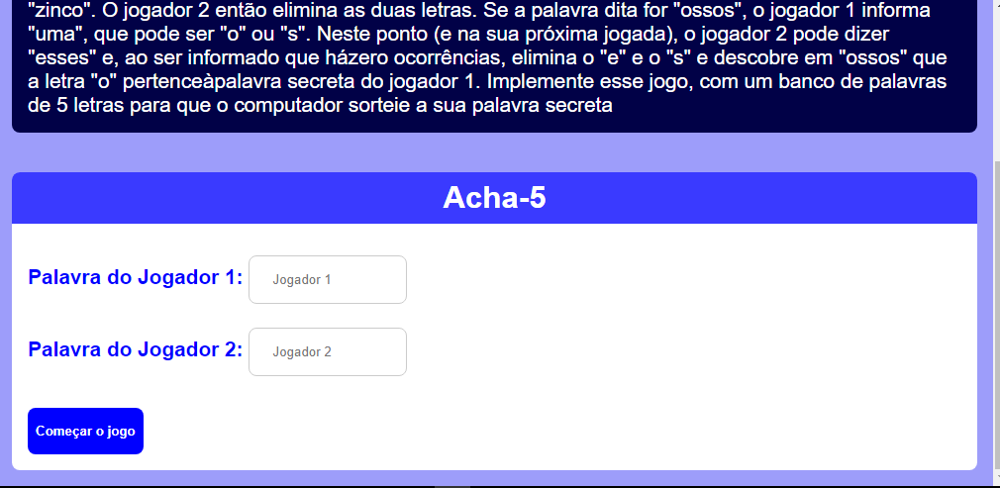
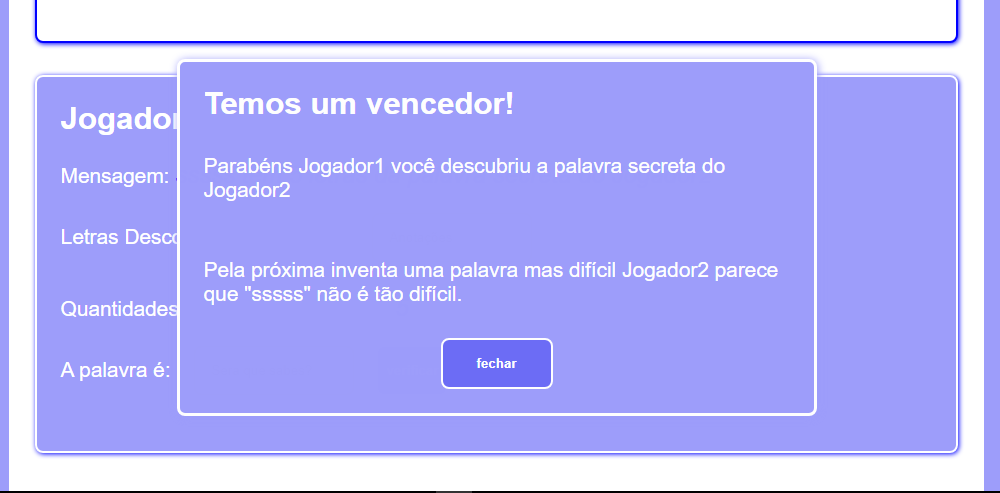

# Projeto Acha-5 TypeScript com React

Este `Projeto` foi desenvolvido para fins de exercicío com o objetivo de melhorar as minhas `habilidades` em `TypeScript` e `React`. Como o nome já diz projeto `Acha-5` funciona da seguinte forma, na primeira fase dois `Jogadores` digitam suas `senhas` e começam o `jogo` depois cada jogador será `responsável` em `descobrir` a palavra secreta do jogador `adversário` se uns dos jogadores descobrir a palavra secreta do adversário será anuciado como `vencedor`.

## Tecnologias

As seguintes ferramentas foram usadas na constuição deste projeto:

- HTML
- CSS
- TYPESCRIPT
- REACT

#

Feito por ❤ Pascoal Kahamba meu [Linkedin](https://www.linkedin.com/in/pascoal-kahamba-7b43bb233?lipi=urn%3Ali%3Apage%3Ad_flagship3_profile_view_base_contact_details%3BTg8LEKayToyytOX1pVAQ%2Bg%3D%3D)

[👉Clique aqui para rodar o projeto👈](https://project-crud.vercel.app/)😎
